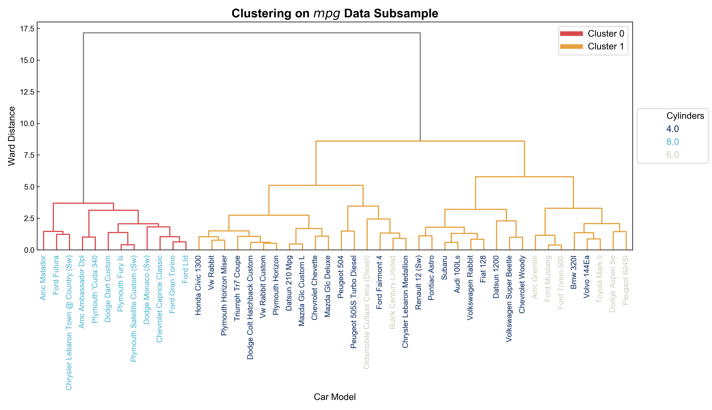
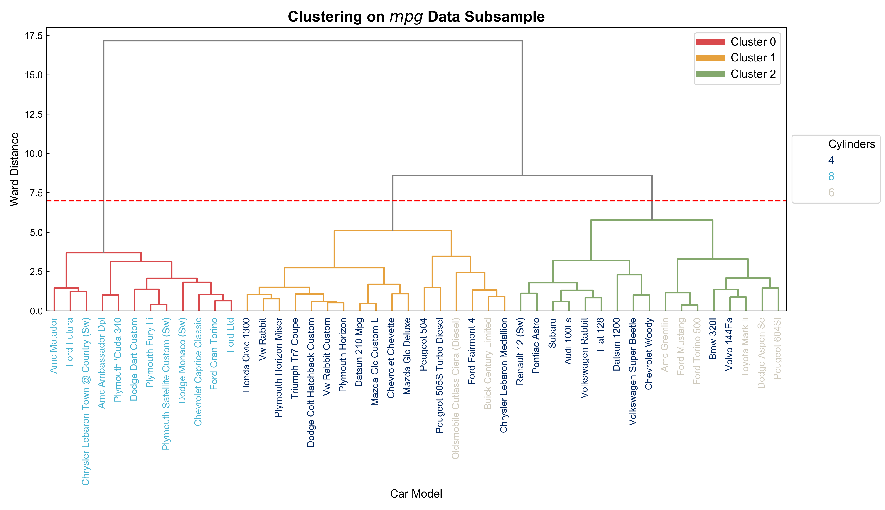

# Dendrogram

Dendrogram serves to show the results of hierarchical clustering. It illustrates the arrangement of the clusters visually.

## Featured

- [x] **Text labels colored by target variable (if applicable)**

  In most cases hierarchical clustering works best with small datasets, and users may want to label each leaf with its own meaningful label instead of index for better interpretability. Furthermore, to check whether the algorithm picks up a certain external pattern and distinct observations in one cluster from all the others based an external feature (not used in the calculation of distance matrix), coloring the labels by a target variable can be helpful. 

  

- [x] **Return clusters as colored in the plot**

  Users often inspect the dendrogram first, then cut the tree with [scipy.cluster.hierarchy.cut_tree](https://docs.scipy.org/doc/scipy/reference/generated/scipy.cluster.hierarchy.cut_tree.html) to get clusters. However, when they describe any cluster of interest, the numbering of clusters in the output from `cut_tree`  could be different from what was just visually shown in the dendrogram. Cases like this harm the consistency of the story, hence it's good to have the exact cluster assignment as colored in the dendrogram.

## Sample Use

We use `mpg` data to illustrate the use of `dendro()` function from the `ml.unsupervised.dendrogram` module. 50 car models are sampled from `mpg` dataset as our subsample. Below are 3 rows from our sample:

| Index                     | mpg  | cylinders | displacement | horsepower | weight | acceleration | model_year |
| ------------------------- | ---- | --------- | ------------ | ---------- | ------ | ------------ | ---------- |
| Peugeot 505S Turbo Diesel | 28.1 | 4         | 141.0        | 80.0       | 3230   | 20.4         | 81         |
| Amc Gremlin               | 19.0 | 6         | 232.0        | 100.0      | 2634   | 13.0         | 71         |
| Volkswagen Super Beetle   | 26.0 | 4         | 97.0         | 46.0       | 1950   | 21.0         | 73         |

Assuming `"cylinders"` is the target, hierarchical clustering works with all other features (scaled by a `StandardScaler`) to assign each automobile to one of the clusters. Leaves of the dendrogram are labelled with the index (*name of the automobile*), and label text is colored according to `"cylinders"`. Below is a sample output (without a user specified threshold):

    

In this example, we can see why coloring leaf label by a target variable improves interpretability: **all the automobiles with 8 cylinders are in cluster 0, and they are so different from 4- and 6-cylinder vehicles.**

To get a specific number of clusters, users need to cut the tree at a certain threshold. **An ideal one in the sample above is at 7, which would give us 3 clusters.** Below is the complete sample output of the `dendro()` function.

    

**`dendro()` function also returns the clustering assignment just as colored in the dendrogram.** Below are 3 rows from the clustered `mpg` subsample.

| index              | mpg  | cylinders | displacement | horsepower | weight | acceleration | model_year | Cluster |
| ------------------ | ---- | --------- | ------------ | ---------- | ------ | ------------ | ---------- | ------- |
| Vw Rabbit          | 41.5 | 4         | 98.0         | 76.0       | 2144   | 14.7         | 80         | 1       |
| Pontiac Astro      | 23.0 | 4         | 140.0        | 78.0       | 2592   | 18.5         | 75         | 2       |
| Amc Ambassador Dpl | 15.0 | 8         | 390.0        | 190.0      | 3850   | 8.5          | 70         | 0       |

